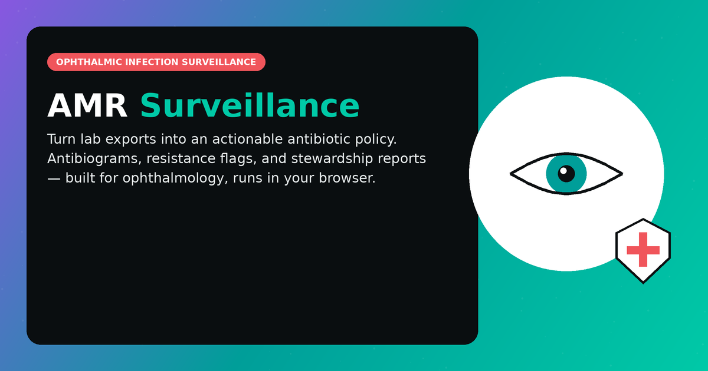

# AMR Surveillance — Ophthalmic Infection & Antibiotic Policy Tracker

A local-first web app that turns lab exports into a committee-ready antibiotic
stewardship report for ophthalmology. Upload CSV/Excel culture data or Word
clinical notes; get standardized antibiograms, flagged resistance patterns,
rule-based remedy suggestions, and an optional AI-written policy summary —
all processed in your browser.

**Live app**: https://lvpeiamr.lovable.app



## What it does

1. **Upload** — CSV, Excel (`.xlsx`/`.xls`), or Word (`.docx`) clinical notes.
   Free-text notes are structured into records via an LLM call; tabular files
   are parsed directly. Column headers are matched flexibly (e.g. "Antibiotic
   Given" and "Drug Used" both map to `antimicrobial_given`).
2. **Anonymize** — every upload is run through a client-side anonymization
   layer before anything is displayed or sent anywhere:
   - Direct identifiers (name, DOB, phone, email, address, Aadhaar,
     insurance) are dropped entirely.
   - Patient ID / MRN / UHID columns are one-way SHA-256 hashed to a
     session-salted pseudonym, so repeat episodes for the same patient stay
     linkable without exposing the real ID.
   - Free-text notes are regex-redacted (names, phone, email, DOB, ID
     numbers) before being sent to the AI for structured extraction.
   - See `src/amr/lib/anonymize.js`. This is best-effort, not a compliance
     guarantee — review extracted output before relying on it for real
     patient data.
3. **Standardize** — organism, antimicrobial, and infection-site names are
   mapped to a reference taxonomy weighted toward ophthalmic pathogens
   (`data/organisms.js`, `data/antimicrobials.js`, `data/infectionSites.js`),
   with a fuzzy-matching fallback for typos, so messy spellings and
   abbreviations (`"p aeruginosa"`, `"moxi"`, `"psuedomonas"`) still resolve
   to canonical entries. A recognition audit in the glossary shows exactly
   what was fuzzy-corrected vs. genuinely unrecognized in your data. Synonym
   matching uses word-boundary-safe matching (`lib/fuzzyMatch.js`,
   `matchesAsToken`), not raw substring matching — a prior bug let the short
   synonym "moxi" (for Moxifloxacin) match inside the unrelated word
   "**a-moxi-**cillin-clavulanate", silently corrupting those records into
   fabricated Moxifloxacin entries; the same class of bug also affected
   Ciprofloxacin/Levofloxacin colliding with Ofloxacin. Fixed and audited
   across all three taxonomies with an automated collision check.
4. **Analyze** — an antibiogram is built following **CLSI M39** cumulative-antibiogram
   methodology (the same standard used by WHONET and the R `AMR` package): only the
   first isolate per patient per organism in the dataset counts by default, so a
   single re-cultured patient can't skew the facility-wide resistance rate. A toggle
   lets you compare against the naive "all isolates" count to see the difference.
   Rule-based flags separately surface patterns like discordant empiric therapy,
   high-resistance drug/organism pairs, and topical-only therapy for endophthalmitis
   (a route-of-administration issue, not necessarily resistance) — these deliberately
   look at every episode, not just first isolates, since a repeat culture showing
   emerging resistance is itself clinically significant.
5. **Track trends over time** — a separate weekly/monthly/yearly view (`lib/trendAnalysis.js`)
   tracks how susceptibility for each organism-antimicrobial pair drifts across the
   periods in your data, with sparkline visualization and automatic "worsening
   resistance" flagging when susceptibility drops meaningfully between the first and
   most recent period with adequate sample size. This is phenotypic resistance drift
   (the same signal ARMOR/GLASS report year over year), not genomic mutation
   tracking — no sequencing data exists anywhere in this pipeline, and the UI is
   explicit about that distinction. Trend directions require ≥2 periods with 5+
   isolates each; smaller samples are honestly marked "insufficient data" rather than
   implying a false trend.

**Organism grouping transparency**: species-level names (e.g. `Fusarium solani`)
roll up into their standardized taxonomy group (`Fusarium species`) by default for a
usable cumulative antibiogram, but the rollup is never silent — each row shows which
raw species names were folded in (`"Fusarium species (incl. Fusarium solani)"`), in
both the on-screen table and exported reports. An "Exact species as entered" toggle
in the Antibiogram section switches off rollup entirely for auditing the original
data.
5. **Contextualize** — a "Global trends & literature" panel surfaces real,
   named AMR surveillance programs and literature relevant to whichever
   organisms are actually present in your data, plus an optional AI briefing
   comparing your local antibiogram to those published trends. Sources are
   organized in three tiers, badged and sorted accordingly:
   - **LVPEI's own published research** (badged "LVPEI") — the 15,822-patient
     network antibiogram (Das & Joseph, J Med Microbiol 2022), the 25-year
     endophthalmitis trends review (Joseph et al., Eye 2019), the 20-year
     Pseudomonas ST308 resistome study (Khan/Sharma et al., Exp Eye Res
     2021), and Sharma's foundational review of ocular antibiotic routes —
     each with real published headline figures the AI briefing explicitly
     compares your data against first.
   - **Peer Indian tertiary eye institutes** (badged by name) — Aravind Eye
     Hospital (10-year MRSA trend study), Sankara Nethralaya (ocular
     Enterobacteriaceae resistance profiling), and AIIMS Dr Rajendra Prasad
     Centre (multi-centric North/Central India keratitis susceptibility
     study) — a second comparison tier: same country, not the same institute.
   - **Broader international sources** (ARMOR, WHO GLASS, EARS-Net, ICMR).

   This is a curated static reference list plus a general-knowledge AI
   synthesis — not a live database query.
6. **Report** — export a `.docx` or `.pdf` stewardship report with the app's
   brand styling (colored headings, severity-coded table cells), optionally
   including an AI-generated plain-language summary and policy
   recommendation grounded strictly in the uploaded data. AI-assisted
   sections are labeled as such (as "Executive Summary" / "Global Trends"
   with a small disclosure line) rather than hidden, and a footer note
   reiterates this — full transparency is kept even though the report can
   carry your own institute name and logo as a letterhead. AI narrative text
   (which may contain markdown bold or Unicode punctuation) is parsed and
   sanitized before rendering so it doesn't corrupt in the PDF's limited font
   encoding — see `lib/textFormatting.js`.
7. **Reference** — a standalone Microbiology Reference tool (available even
   without uploaded data) covers organisms, antimicrobials, infection sites,
   and established combination-therapy/synergy regimens used in ophthalmic
   infection management (e.g. fortified cefazolin+tobramycin for bacterial
   keratitis, intravitreal vancomycin+ceftazidime for endophthalmitis) — each
   entry cites its clinical source. See `data/combinationRegimens.js`.

## Architecture

- **React + Vite + TanStack Start**, deployed as a static/edge app (Cloudflare
  Workers via Nitro).
- **Tailwind v4** for styling; app-specific brand tokens (teal/violet/coral
  gradient) live in `src/styles.css`.
- **Groq** (OpenAI-compatible endpoint) powers the optional AI features:
  document-to-record extraction, the policy narrative, and the global-trends
  briefing. Default model: `openai/gpt-oss-120b`.
- All core logic — parsing, anonymization, standardization, flagging,
  antibiogram construction, report export — runs client-side with no
  backend. Only the AI calls leave the browser (directly to Groq's API).

```
src/amr/
  App.jsx                     # top-level layout & state
  components/                 # FileUpload, AntibiogramTable, FlaggedPatterns,
                               # RemedySuggestions, PolicyNarrative,
                               # TrendsInsightPanel, ExportButtons
  lib/
    fileParsers.js            # CSV/Excel/DOCX parsing + header aliasing
    anonymize.js               # PII drop/hash/redact layer
    analyze.js                 # standardization, antibiogram, flags, remedies
    groqClient.js               # Groq API calls (extraction, narrative, trends)
    exportReport.js            # .docx / .pdf report generation
  data/
    organisms.js                # ophthalmic-pathogen reference taxonomy
    antimicrobials.js           # antimicrobial reference taxonomy
    globalSurveillance.js       # curated AMR surveillance programs/literature
```

## Security notes for deployers

- The Groq API key is entered in-app (session-only, never persisted) and
  used to call Groq **directly from the browser** — the key is visible in
  network requests while active. For a production deployment, proxy these
  calls through a server-side function (e.g. a Supabase Edge Function) so
  the key is never exposed client-side.
- The anonymization layer runs entirely in-browser and nothing is uploaded
  or logged externally except the (already-anonymized/redacted) payload sent
  to Groq for AI features. If you don't need the AI features, the app is
  fully usable — and fully local — without ever entering an API key.

## Development

Requires Node.js and npm — [install with nvm](https://github.com/nvm-sh/nvm#installing-and-updating).

```sh
git clone https://github.com/satyasundarthakur-png/lvpeiamr.git
cd lvpeiamr
npm i
npm run dev
```

Build for production:

```sh
npm run build
```

## Build with Lovable

This project was built with [Lovable](https://lovable.dev) and continues to
sync with the [Lovable editor](https://lovable.dev/projects/de9e6590-01a0-4cea-bc2b-d2df4f9a3cc3) —
changes pushed to `main` on GitHub sync back into Lovable, and vice versa.
